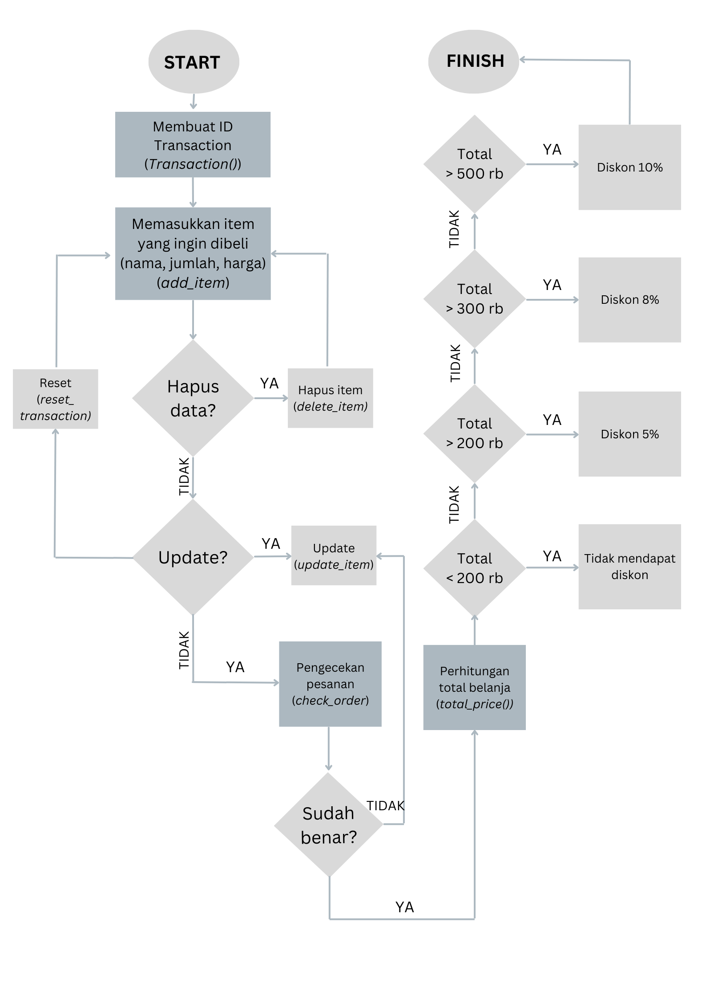

**Super Cashier**

**Latar Belakang**

Kasir merupakan salah satu kegiatan transaksi jual beli yang lumrah di pertokoan. Sistem kasir ini mememiliki beberapa fitur diantaranya adalah menjumlah barang belanja, membuat laporan rutin pembelian dan lain sebagainya. Pada project ini dibuat super cashier dengan menggunakan Bahasa Python yang diharapkan dapat berguna untuk mempermudah profesi kasir ke depannya

Objectives yang dibutuhkan

Dalam sistem kasir ini, terdapat feature-feature sebagai berikut:

a. Membuat proses untuk memasukkan ID Transaksi

b. Membuat proses untuk menambahkan barang yang ini dibeli dan detail jumlah dan harganya

c. Membuat proses untuk mengupdate detail barang yang sudah diinputkan sebelumnya jika ada kesalahan input

d. Membuat proses untuk menghapus salah satu pesanan yang telah diinputkan

e. Membuat proses untuk menghapus seluruh transaksi yang telah diinputkan

f. Membuat proses untuk memeriksa apakah seluruh data yang diinput sudah benar dan lengkap

g. Membuat proses untuk menghitung total belanja yang harus dibayarkan dan diskon yang didapatkan (jika dapat).

**Alur code atau Flowchart**

**Fungsi dan Atribut yang digunakan**

1. Init()

Metode instalasi untuk class Transaction

cart (dict) = dictionary untuk menyimpan data transaksi

2. Add\_item

Metode untuk menambahkan item pada dict

Item\_name : str

Item\_qty : int

Item\_price : int

3. Update\_item\_name

Metode untuk mengganti nama pada item

.pop : untuk menghilangkan item\_name yang lama

.update : untuk mengganti item\_name dengan yang baru

4. Update\_item\_qty

Metode untuk mengganti jumlah pada item

5. Update\_item\_price

Metode untuk mengganti harga pada item

6. Delete\_item

Metode untuk menghapus pesanan

7. Reset\_item

Metode untuk menghapus seluruh pesanan

8. Show\_order

Metode untuk menampilkan pesanan yang sudah terinput di dict

9. Total\_price

Metode untuk menjumlahkan total belanja

**Demonstrasi**

1. Menambahkan item

Customer ingin menambahkan dua item dalam daftar pesanan. Item tersebut adalah:

a. Ayam Goreng sebanyak 2 buah seharga 20.000
b. Pasta Gigi sebanyak 3 buah seharga 15.000

Method yang digunakan adalah add\_item

2. Mengapus item

Customer ingin membatalkan pesanan Pasta Giginya

Method yang digunakan adalah delete\_item

3. Menghapus  semua pesanan

Customer ingin membatalkan semua pesanan

Method yang digunakan adalah reset\_item

4. Menghitung Total belanja

Customer ingin membayar belanjanya, sehingga diperlukan total  yang harus dibayar

Method yang digunakan adalah total\_price

**Conclusion**
Dalam sistem kasir ini, dapat disimpulkan bahwa sistem kasir ini dapat digunakan untuk berbagai feature

